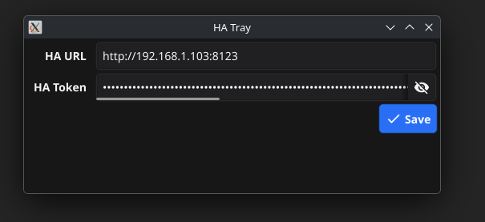
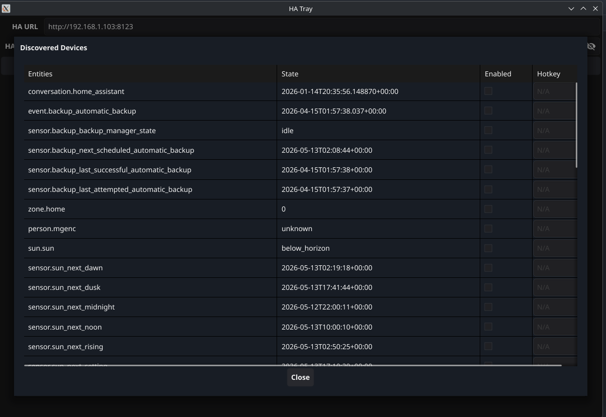

# Home Assistant Tray

A cross-platform native system tray application for toggling Home Assistant entities. Inspired by [home-assistant-tray-menu](https://github.com/PascalLuginbuehl/home-assistant-tray-menu).





## Features

- System tray icon with per-entity toggle menu
- Entity discovery and selection via HA REST API
- Entity toggle via HA WebSocket API
- Global hotkeys (Windows only — type `Ctrl+Alt+K` style bindings per entity)
- Debounced auto-save configuration

## Tech Stack

- **Go 1.24+** — single `package main`, no internal packages
- **[Fyne](https://fyne.io/) v2** — cross-platform GUI framework (system tray, tables, dialogs)
- **[gorilla/websocket](https://github.com/gorilla/websocket)** — HA WebSocket API client
- **[godotenv](https://github.com/joho/godotenv)** — `.env` file loading
- `logger.go` — structured JSON logging via `log/slog`
- **[golang.org/x/sys](https://pkg.go.dev/golang.org/x/sys)** — Win32 syscall wrappers for global hotkeys
- **[log/slog](https://pkg.go.dev/log/slog)** — structured JSON file logging (stdlib)

## Prerequisites

- Go 1.24+
- C compiler (GCC on Linux, MSVC on Windows — CGO is required by Fyne)
- Display server (the app opens a GUI window and registers a system tray icon)

**Linux** — install development headers:
```bash
sudo apt-get install gcc libgl1-mesa-dev libwayland-dev libx11-dev libxkbcommon-dev xorg-dev
```

**Windows** — no extra dependencies. CGO uses the built-in MSVC toolchain.

## Build Locally

```bash
go build -o ha-tray .
```

Or with the Fyne CLI (includes icon and metadata embedding):
```bash
go install fyne.io/fyne/v2/cmd/fyne@latest
fyne package -os linux -icon Icon.png -release   # produces ha-tray.tar.gz
fyne package -os windows -icon Icon.png -release  # produces ha-tray.exe
```

## Run

```bash
go run .
```

On first launch the app creates `config.json` in the working directory and opens the settings window. Enter your Home Assistant URL and long-lived access token.

## Configuration

The app reads configuration from two sources (in order):

1. **`.env`** file in the working directory — set `haURL` and `haToken` environment variables
2. **`config.json`** — auto-created runtime config, edited via the settings UI

Both files are gitignored and contain credentials.

### Example `config.json`

```json
{
  "ha_url": "http://192.168.1.103:8123",
  "ha_token": "your-long-lived-access-token",
  "enabled_entities": {
    "switch.living_room": true
  },
  "hotkeys": {
    "switch.living_room": {
      "modifiers": ["ctrl", "alt"],
      "key": "l"
    },
    "switch.bedroom": {
      "modifiers": ["ctrl", "alt"],
      "key": "b",
      "enabled": false
    }
  },
  "log_level": "info",
  "log_file": "ha-tray.log"
}
```

### Global Hotkeys

Hotkeys are supported on **Windows only**. On Linux and macOS the hotkey column shows "N/A".

Format: `Ctrl+Alt+L`, `Ctrl+Shift+F5`, etc. At least one modifier is required.

Set `"enabled": false` on a hotkey binding to disable it without deleting the configuration. Omitting `enabled` defaults to `true`.

### Logging

All application events are written to a structured JSON log file. Configure in `config.json`:

| Field | Values | Default |
|---|---|---|
| `log_level` | `debug`, `info`, `warn`, `error` | `info` |
| `log_file` | file path (relative to working dir) | `ha-tray.log` |

Log files are gitignored (`*.log`).

### CLI Trigger (Linux hotkey alternative)

The `-trigger` flag toggles an entity and exits immediately — no GUI, no display server needed. This is the recommended way to bind hotkeys on Linux:

```bash
ha-tray -trigger switch.living_room
```

Bind it in your desktop environment's keyboard shortcuts (e.g. GNOME Settings → Keyboard → Custom Shortcuts):

```
Name:     Toggle Living Room
Command:  /path/to/ha-tray -trigger switch.living_room
Shortcut: Ctrl+Alt+L
```

Exit code 0 on success, 1 on failure. Prints `toggled <entity>` to stdout or an error message to stderr.

## Cross-Compilation (Windows from Linux)

Uses [fyne-cross](https://github.com/fyne-io/fyne-cross) with Docker:

```bash
go install github.com/fyne-io/fyne-cross@latest
fyne-cross windows
```

Output: `fyne-cross/dist/windows-amd64/ha-tray.exe.zip`

## Releases

Pushing a `v*` tag triggers the [GitHub Actions release workflow](.github/workflows/release.yml):

```bash
git tag v1.0.0
git push origin v1.0.0
```

The workflow builds native binaries on `ubuntu-latest` and `windows-latest` runners using `fyne package`, then creates a GitHub Release with both artifacts attached.

## License

This project is provided as-is for personal use.
